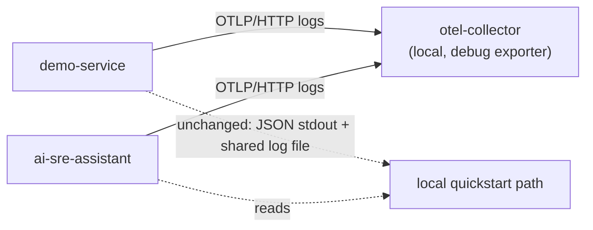

# OpenTelemetry Collector Path

Week 7, Day 2 adds an optional OpenTelemetry Collector to the local stack. This is [Migration Path](18-production-observability.md#migration-path) step 3: "introduce a collector once signal contracts are stable." Step 2, structured stdout logs and a shared `request_id`/`correlated_request_ids` correlation field, shipped on [Day 1](build-log.md#week-7-day-1---structured-assistant-logs-and-cross-service-correlation).

## Why This Is Optional

`make up` never starts a collector and never sets `OTEL_EXPORTER_OTLP_ENDPOINT`. That is intentional: the Week 7 exit gate requires a complete symptom-to-recovery workflow "without changing the dependency-light quickstart." A beginner running `make up` for the first time should not need to reason about collectors, receivers, or exporters before they see their first log line.

The collector path exists as a second, opt-in step for once the local shared-log workflow feels familiar and you want to see what changes on the way to a real deployment.

## What Gets Added



Both services keep writing to stdout (and, for `demo-service`, the shared log file `ai-sre-assistant` reads) exactly as before. The collector receives an independent copy of the same structured events over OTLP - it is additive, not a replacement for the local path.

## Running It

```bash
make otel-up    # starts demo-service, ai-sre-assistant, and otel-collector together
make otel-logs  # follow the collector's own output and watch log records arrive
make otel-down
```

Or directly, without `make`:

```bash
docker compose -f docker-compose.yml -f infra/docker/docker-compose.otel.yml up --build -d
docker compose -f docker-compose.yml -f infra/docker/docker-compose.otel.yml logs -f otel-collector
docker compose -f docker-compose.yml -f infra/docker/docker-compose.otel.yml down
```

Generate some traffic (`make generate-traffic`, or hit `/simulate/error` and `/simulate/latency` directly) and `otel-collector`'s logs will show each event as a decoded OTLP `LogRecord`, with the same `event`, `request_id`, and other fields the local JSON log line carries.

## What's In `infra/docker/`

- `docker-compose.otel.yml` - a Compose overlay, not a replacement file. It adds the `otel-collector` service and merges `OTEL_EXPORTER_OTLP_ENDPOINT=http://otel-collector:4318` into both app services' environments. `make otel-up` always passes it alongside `docker-compose.yml`; neither file works as a full stack on its own.
- `otel-collector-config.yaml` - an OTLP receiver (HTTP on `4318`, gRPC on `4317`), a `batch` processor, and a `debug` exporter that prints every received record. There is deliberately no backend exporter configured yet; choosing and wiring a real backend is [Migration Path](18-production-observability.md#migration-path) step 4, a later, separate decision.

## How Export Works

`app/otel_exporter.py` (one copy per service, matching this project's existing per-service `logging_config.py` duplication) adds a `logging.Handler` that:

1. Converts each `LogRecord` into a single OTLP JSON `logRecord`, reusing the exact same "which extra fields count as evidence" rule `JsonFormatter` already uses, so a collector never sees more or less than the local JSON log line shows.
2. POSTs it to `{OTEL_EXPORTER_OTLP_ENDPOINT}/v1/logs` with a short timeout (`OTEL_EXPORTER_OTLP_TIMEOUT_SECONDS`, default `1.0`).
3. Swallows every export failure through the standard `logging.Handler.handleError` path. A collector that is down, slow, or missing must never break a request.

This is intentionally the simplest exporter that demonstrates the real OTLP/HTTP logs contract, not a production one. It ships one record per synchronous HTTP call on whatever thread calls the logger, instead of batching and exporting off the request path. A production exporter should use the OpenTelemetry SDK's `BatchLogRecordProcessor`, which does exactly that - this project keeps that dependency out of the default install so the collector path stays opt-in cost, not opt-in complexity, matching [CONTRIBUTING.md](../CONTRIBUTING.md)'s "keep dependencies minimal" principle. If you enable this in a setting with meaningful request volume, expect a slow or unreachable collector to add up to `OTEL_EXPORTER_OTLP_TIMEOUT_SECONDS` of latency per logged event.

## Env Vars

| Variable | Default | Effect |
| --- | --- | --- |
| `OTEL_EXPORTER_OTLP_ENDPOINT` | unset | OTLP export is disabled. Set to a collector base URL (`make otel-up` sets `http://otel-collector:4318`) to enable it. |
| `OTEL_EXPORTER_OTLP_TIMEOUT_SECONDS` | `1.0` | Per-record export timeout. |

## What This Does Not Do Yet

- No metrics or traces pipeline - `/metrics` stays a direct Prometheus-style scrape target, unchanged. Routing every signal type through the collector is Migration Path step 4.
- No backend, dashboard, or alert. That is Week 7, Day 3+.
- No batching or async export. See "How Export Works" above.

Next: a small dashboard and one actionable, owned alert, once a backend is chosen to build them against.
